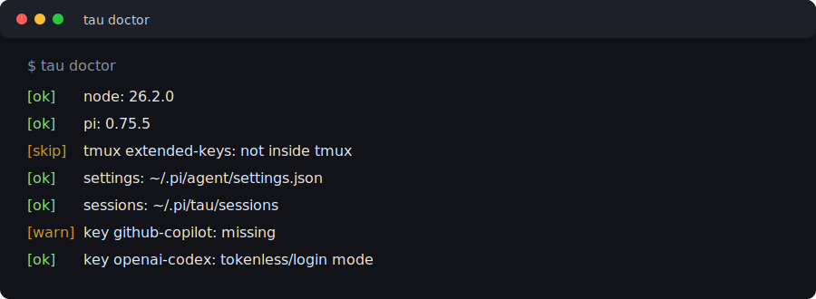
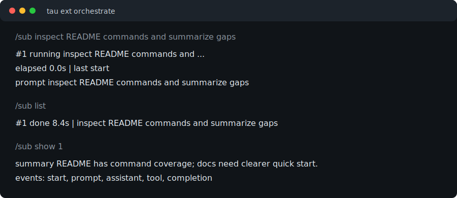

# tau

Tau is my local command layer on top of `pi`: profiles, task aliases, custom prompts, safety extensions, orchestration helpers, and release hygiene in one repo.

It stays a wrapper. The runtime is still the globally installed `pi`; Tau only controls how it starts.



## Highlights

- Global `tau` command through package `bin`.
- Versioned profiles and aliases in `config/tau.config.json`.
- Personal system prompt loaded by default.
- Isolated Tau sessions in `~/.pi/tau/sessions`.
- `tau doctor` health checks for Node, Pi, tmux, settings, sessions, and provider auth.
- Extension presets for focus, safety, personas, chains, and orchestration.
- Tau theme pack with `/theme` switching in `vibe` mode.
- Subagent observability with `/sub list`, `/sub show <id>`, and `/sub open <id>`.
- Changesets for local release/version flow.

## Quick Start

```bash
npm install
npm link
tau doctor
tau fast "summarize this repo"
```

Install upstream Pi if missing:

```bash
npm i -g @earendil-works/pi-coding-agent
```

Run without global link:

```bash
npm run tau -- fast "summarize this repo"
```

## Daily Commands

| Command | Use |
| --- | --- |
| `tau ask "question"` | Quick print-mode answer. |
| `tau code "task"` | Default coding session. |
| `tau plan "scope"` | Read-only planning output. |
| `tau review "diff"` | Read-only review, no shell. |
| `tau debug "failure"` | Investigation with shell, no edit tools. |
| `tau ship "task"` | Explicit implementation mode. |
| `tau doctor` | Local health check. |
| `tau ext vibe "task"` | Banner, theme cycler, and live footers. |
| `tau ext orchestrate "task"` | Subagents, replay, cross-agent loader. |

Full command reference: [docs/COMMANDS.md](docs/COMMANDS.md).

## Profiles

Profiles expand to provider, model, thinking level, and optional model cycling.

| Profile | Purpose | Provider/model |
| --- | --- | --- |
| `fast` | Cheap questions, summaries, quick checks. | `openai-codex/gpt-5.3-codex-spark:low` |
| `work` | Explicit GitHub Copilot run. | `github-copilot/gpt-5.5:medium` |
| `deep` | Hard bugs, design review, high-stakes reasoning. | `openai-codex/gpt-5.5:xhigh` |
| `router` | Long or uncertain sessions with Ctrl+P model cycling. | `fast` + `fast,deep` model list |

Examples:

```bash
tau fast "summarize this repo"
tau deep "debug this hard bug"
tau router "work where model may change"
tau ship --profile deep "ship harder change"
```

## Orchestration

Use orchestration mode for background research and auditability.

```bash
tau ext orchestrate "coordinate repo inspection"
```

Inside Tau:

```text
/sub inspect README commands and summarize gaps
/sub list
/sub show 1
/sub open 1
/replay all
/xload agent
```



## Extensions

| Preset | Stack |
| --- | --- |
| `tau ext banner` | Tau banner only. |
| `tau ext minimal` | Banner + status footer. |
| `tau ext focus` | Purpose gate + task discipline + pure focus + status footer. |
| `tau ext safe` | Banner + purpose gate + task discipline + damage control + footers. |
| `tau ext damage` | Banner + damage control + footers. |
| `tau ext damage-continue` | Damage control with continue-safe prompt. |
| `tau ext team` | Banner + persona selector + footers. |
| `tau ext chain` | Banner + persona selector + footers. |
| `tau ext vibe` | Banner + theme cycler + status/tool footers. |
| `tau ext orchestrate` | Banner + subagents + replay + cross-agent loader + footers. |

Common in-session commands:

```text
/theme
/theme tau-dark
/theme tau-focus
/theme tau-alert
/system list
/system builder
/purpose finish M8
/task add implement purpose gate
/task start 1
/task done 1
/task list
/sub inspect docs
/sub list
/sub show 1
/replay all
/xload
```

Theme shortcuts in `vibe`:

- `Ctrl+Shift+T`: next theme.
- `Ctrl+Alt+T`: previous theme.

## Repository Layout

| Path | Purpose |
| --- | --- |
| `bin/tau.js` | Wrapper/router that resolves profiles, aliases, prompts, auth, and sessions. |
| `config/tau.config.json` | Profiles, aliases, provider key checks, extension presets. |
| `extensions/` | Curated Tau extension entrypoints. |
| `.pi/agents/` | Specialist personas, teams, chains. |
| `.pi/themes/` | Tau dark, focus, and alert TUI themes. |
| `.pi/research/` | Approved research notes before implementation. |
| `.pi/damage-control-rules.yaml` | Blocked command and sensitive path regexes. |
| `prompts/system-prompt.md` | Default Tau system prompt. |
| `test/tau.test.js` | Node regression tests for wrapper and extension contracts. |
| `docs/` | Command reference and visual docs. |

## Configuration

Config lives in `config/tau.config.json`.

- `defaultProfile`: fallback profile.
- `profiles`: provider/model/thinking presets.
- `profiles.router.models`: exact model cycling list.
- `aliases`: command presets with profile, extra args, and optional prompt.
- `extensionPresets`: named `tau ext` stacks.
- `providerKeys`: env var names checked by `tau doctor`; values are never printed.

Override config:

```bash
TAU_CONFIG_PATH=./other-config.json tau doctor
```

Wrapper knobs:

```bash
TAU_SETTINGS_PATH=./profiles/dev.json tau
TAU_BANNER=my-ops-pi tau
TAU_NO_PROMPT=1 tau ask "raw upstream behavior"
TAU_SKIP_AUTH_CHECK=1 tau
```

## Health And Tests

```bash
npm test
tau doctor
npx changeset status
```

`tau doctor` exits non-zero on required check failures. Missing provider keys are warnings when another auth mode exists.

## Release Flow

Tau is currently private. Do not publish.

```bash
npx changeset
npx changeset version
npm test
tau doctor
```

Only publish if `package.json` stops being private and the package is intended for distribution:

```bash
npx changeset publish
```
